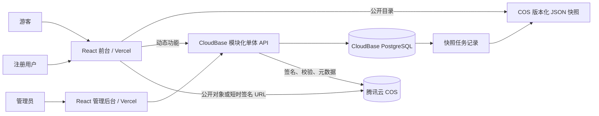

# 利韩土豆仓技术架构与管理后台重构设计

> 版本：1.0
>
> 日期：2026-09-17
>
> 状态：待用户最终审阅
> 适用规模：注册用户不超过 1,000，单站点、单区域、非商业社区

## 1. 文档目的

本文档定义利韩土豆仓下一阶段的技术底座和管理后台。重构保留现有前台视觉、页面入口、内容与小游戏，不进行品牌和交互风格重做；重点解决后台耦合、数据源分散、上传限制、账号互动、受限内容访问、测试缺失和安全边界不清等问题。

本文档是后续数据库迁移、API 开发、后台重写和上线验收的设计基线。实施前还需基于本设计生成逐文件开发计划。

## 2. 已确认的产品决策

| 主题 | 决策 |
|---|---|
| 基础设施 | 继续使用 Vercel、腾讯 CloudBase、腾讯云 COS |
| 架构 | 模块化单体，不引入微服务、Redis、消息队列或 Kubernetes |
| 数据主源 | CloudBase PostgreSQL 是可编辑业务数据的唯一事实来源 |
| 公共读取 | 普通公开目录生成版本化 JSON 快照，由 COS/CDN 提供 |
| 文件存储 | 图片、小说正文、音频和附件存入 COS，数据库只保存 object key 与元数据 |
| 管理员 | 支持多个独立管理员账号，第一期权限相同；保留 role 字段 |
| 用户注册 | 无邮箱、无邀请码；通过随机答题后设置用户名和密码并自动激活 |
| 账号恢复 | 使用一次性恢复码；密码和恢复码同时遗失后账号永久不可恢复 |
| 用户功能 | 受限内容访问、点赞、收藏、评论、阅读进度、投稿 |
| 评论审核 | 正常评论默认发布；新号、异常频率或敏感规则命中时进入待审核 |
| 年龄信息 | 不收集出生日期，只保存“已声明年满 18 岁”、时间和条款版本 |
| 受限内容 | 私有 COS + 服务端授权 + 短时签名 URL；不进入公开快照 |
| 合规边界 | 技术访问控制不能使违法内容合法化，也不能作为规避平台或监管审查的手段 |

## 3. 当前系统盘点

### 3.1 当前组成

- Vite + React 19 前台，部署到 Vercel，并带有 PWA、漫画阅读、小说阅读、资源导航、投稿、树洞和小游戏入口。
- `public/admin/index.html` 是约 1,962 行的独立管理页面，包含 UI、状态、图片编辑、上传和 API 调用。
- `cloudbase/functions/admin-upload/index.js` 是约 774 行的单文件云函数，集中承担登录、COS 写入、漫画、小说、标签、推荐和投稿审核。
- 腾讯云 COS 保存 `archive.json`、`tags.json`、`novels.json`、`recs.json`、`treehole.json`、漫画图片和小说正文。
- CloudBase PostgreSQL 目前仅保存 `submission_inbox`。
- 漫画上传将图片转为 Base64 后经过云函数，受请求体大小限制。
- 前台直接读取 COS JSON，并根据 object key 拼接公开资源地址。

### 3.2 主要问题

| 级别 | 问题 | 影响 |
|---|---|---|
| P0 | 自动化测试脚本提交了明文管理员密码 | 共享口令已不应视为安全凭证，必须立即轮换 |
| P0 | 受限漫画对象公开可读，门禁只记录在前端 | 知道或猜到 URL 即可绕过访问门槛 |
| P0 | 登录、答题、投稿等公开入口缺乏系统化限流 | 暴力尝试、批量注册、垃圾内容和资源费用风险 |
| P1 | COS JSON 承担数据库职责 | 并发覆盖、约束缺失、审计困难、CRUD 成本高 |
| P1 | Base64 上传经过云函数 | 体积膨胀、请求容易超限、失败后只能整体重试 |
| P1 | 单文件后台和单文件云函数高度耦合 | 修改风险大，难以单测和多人维护 |
| P1 | 本地兜底数据、COS JSON 和数据库职责重复 | 线上与仓库内容可能不一致 |
| P2 | 用户互动、阅读记录和内容治理缺少统一模型 | 无法可靠扩展账号功能 |
| P2 | 缺少统一 API 版本、错误码和 requestId | 故障定位、兼容和自动化测试困难 |

## 4. 设计目标与非目标

### 4.1 设计目标

1. 管理员可在后台完成草稿、上传、预览、发布、下架、恢复和审核，不再手改 COS JSON。
2. PostgreSQL 管理业务关系、约束、状态和审计；COS 只管理二进制或大文本对象。
3. 普通公开浏览继续享受 COS/CDN 的低成本和高可用。
4. 漫画和投稿附件使用浏览器直传，云函数不转发大文件。
5. 支持无邮箱答题注册、多管理员、点赞、收藏、评论、跨设备进度和投稿。
6. 受限对象无法通过永久公开地址绕过服务端检查。
7. API、数据库和后台按领域拆分，模块可独立理解、测试和替换。
8. 在 1,000 用户规模内保持最低合理复杂度和运维成本。

### 4.2 非目标

- 不重做现有品牌视觉和主要前台导航。
- 不建设付费、私信、实时聊天、关注流、推荐算法或全文搜索集群。
- 不建设多租户、多区域容灾或独立微服务。
- 不承诺通过年龄声明完成实名年龄验证。
- 不以隐藏、加密或私有访问帮助传播违法内容。

## 5. 总体架构



### 5.1 组件职责

| 组件 | 职责 | 不承担的职责 |
|---|---|---|
| React 前台 | 展示、阅读、互动、注册答题、投稿 | 不直接写数据库，不持有云密钥 |
| React 管理后台 | 内容、素材、审核、用户、题库、配置和审计 | 不直接覆盖 COS JSON，不在浏览器保存长期密钥 |
| CloudBase API | 鉴权、校验、业务规则、事务入口、COS 签名和日志 | 不转发大文件，不保存页面状态 |
| PostgreSQL | 用户、状态、关系、互动、投稿、任务和审计的事实来源 | 不保存漫画图片，不保存永久签名 URL |
| COS 公开区 | 普通资源、打码封面、版本化公共快照 | 不保存隐私数据或受限对象永久公开地址 |
| COS 私有区 | 合法合规的受限对象、投稿附件 | 不作为权限数据库 |
| COS staging | 未确认上传对象 | 不长期保存；过期自动清理 |

## 6. 代码组织

保持一个 Git 仓库和一个主要 `package.json`，避免第一期引入复杂工作区管理。目标目录如下：

```text
src/
  web/                    # 现有前台逐步迁入
    app/
    features/
    pages/
  admin/                  # 新 React 管理后台
    app/
    features/
    pages/
  shared/
    api/                  # 类型化 API 客户端
    contracts/            # 请求、响应、错误和枚举
    ui/                   # 可复用但无业务含义的 UI
    utils/

server/
  src/
    http/                 # 路由、Cookie、CSRF、限流、错误处理
    modules/
      auth/
      works/
      uploads/
      interactions/
      submissions/
      moderation/
      admin/
      snapshots/
    infrastructure/
      db/
      cos/
      logging/
      security/
    jobs/
      snapshot-worker.ts
      staging-cleanup.ts
  index.ts                # CloudBase 唯一入口

db/
  migrations/
  seeds/
  checks/

tests/
  unit/
  integration/
  e2e/
```

规则：

- 路由层只解析 HTTP、调用领域服务并映射响应。
- 领域服务表达业务规则，不依赖 React 或具体 HTTP 框架。
- 数据访问集中在 repository，禁止组件或路由直接拼 SQL。
- COS object key 由服务端生成，前端不得自定义完整路径。
- 请求和响应 schema 在前后端共享；服务端始终重新校验，不能信任前端类型。
- 旧 `admin-upload` 在迁移期作为兼容适配层，最终只保留新入口。

## 7. 数据模型

所有主键使用 UUID 或等价高熵 ID。数据库字段使用 `snake_case`，API 使用 `camelCase`。时间统一为 UTC `timestamptz`。

### 7.1 身份与注册

| 表 | 关键字段 | 说明 |
|---|---|---|
| `users` | `id`, `username`, `password_hash`, `role`, `status`, `created_at`, `last_login_at` | `username` 大小写归一后唯一；`role` 首期为 member/admin |
| `user_sessions` | `id`, `user_id`, `token_hash`, `expires_at`, `last_seen_at`, `revoked_at`, `ip_hash` | 浏览器只持有随机 session token，数据库存哈希 |
| `question_bank` | `id`, `prompt`, `accepted_answer_hashes`, `normalization_rule`, `status`, `version` | 仅服务端可读；不保存明文答案；题目可停用和版本化 |
| `registration_challenges` | `id`, `question_ids`, `score`, `status`, `attempt_count`, `expires_at`, `ip_hash` | 不保存完整用户作答；通过后签发一次性注册票据 |
| `registration_tickets` | `id`, `challenge_id`, `token_hash`, `expires_at`, `used_at` | 短时、一次性、只能创建一个账号 |
| `recovery_codes` | `id`, `user_id`, `code_hash`, `used_at`, `created_at` | 明文只展示一次；每个恢复码只能使用一次 |
| `age_consents` | `user_id`, `policy_version`, `accepted_at`, `revoked_at` | 不保存生日，仅保存声明和版本 |

无邮箱账号的恢复规则是产品规则而非临时限制：如果用户同时丢失密码和所有恢复码，账号永久无法找回；管理员界面不提供绕过式密码重置。

### 7.2 作品与素材

| 表 | 关键字段 | 说明 |
|---|---|---|
| `works` | `id`, `slug`, `type`, `title`, `summary`, `rating`, `status`, `version`, `author_name`, `published_at` | 漫画和小说统一主表；`version` 用于乐观锁 |
| `work_assets` | `id`, `work_id`, `kind`, `object_key`, `access_level`, `mime_type`, `size_bytes`, `checksum`, `page_no`, `status` | 封面、漫画页、正文和附件统一引用 |
| `tags` | `id`, `slug`, `name`, `status` | 标签名称和 slug 唯一 |
| `work_tags` | `work_id`, `tag_id` | 多对多；联合主键防重复 |
| `work_versions` | `id`, `work_id`, `version`, `snapshot`, `created_by`, `created_at` | 保存关键元数据版本，支持审计和恢复 |

主要枚举：

- `works.type`: `comic`, `novel`；后续可扩展 `art`, `resource`。
- `works.status`: `draft`, `review`, `published`, `archived`, `deleted`。
- `works.rating`: `general`, `mature`, `restricted`。
- `work_assets.kind`: `cover`, `page`, `body`, `attachment`, `preview`。
- `work_assets.access_level`: `public`, `private`。
- `work_assets.status`: `staging`, `verified`, `active`, `orphaned`, `deleted`。

### 7.3 互动与阅读

| 表 | 关键字段 | 约束与策略 |
|---|---|---|
| `work_likes` | `user_id`, `work_id`, `created_at` | 联合唯一，PUT/DELETE 幂等 |
| `favorites` | `user_id`, `work_id`, `created_at` | 联合唯一 |
| `comments` | `id`, `work_id`, `user_id`, `parent_id`, `body`, `status`, `risk_level`, `created_at`, `deleted_at` | 第一阶段最多一层回复；软删除 |
| `reading_progress` | `user_id`, `work_id`, `position`, `percent`, `updated_at` | 联合唯一；客户端合并同步 |
| `reports` | `id`, `reporter_id`, `target_type`, `target_id`, `reason`, `status`, `handled_by` | 同一用户对同一目标限制重复举报 |

评论状态：`pending`, `published`, `hidden`, `deleted`, `rejected`。正常账号的低风险评论直接进入 `published`；新账号、频率异常或规则命中进入 `pending`。

### 7.4 投稿、上传和运营

| 表 | 关键字段 | 说明 |
|---|---|---|
| `submissions` | `id`, `user_id`, `type`, `title`, `payload`, `status`, `created_at`, `updated_at` | 统一投稿箱，避免按类型建多个孤立流程 |
| `submission_assets` | `submission_id`, `asset_id` | 只允许引用已校验且属于该用户上传会话的对象 |
| `moderation_actions` | `id`, `target_type`, `target_id`, `action`, `reason`, `admin_id`, `created_at` | 审核过程不可覆盖，只追加 |
| `upload_sessions` | `id`, `owner_id`, `purpose`, `status`, `expires_at` | 管理上传与用户投稿共用 |
| `upload_files` | `id`, `session_id`, `object_key`, `expected_size`, `actual_size`, `mime_type`, `checksum`, `status` | 服务端确认后才能绑定业务对象 |
| `snapshot_jobs` | `id`, `snapshot_type`, `source_version`, `status`, `attempts`, `last_error`, `created_at` | 与发布事务一起创建，失败后重试 |
| `audit_logs` | `id`, `actor_id`, `action`, `target_type`, `target_id`, `summary`, `request_id`, `created_at` | 不保存密码、恢复码、会话 token 或正文副本 |
| `site_settings` | `key`, `value`, `version`, `updated_by`, `updated_at` | 公告、功能开关和策略版本 |
| `blocked_subjects` | `id`, `subject_type`, `subject_hash`, `reason`, `expires_at` | 用户、IP 哈希或其他风控主体 |

### 7.5 必要索引与约束

- `users(lower(username))` 唯一索引。
- 所有外键建立对应索引；默认禁止物理删除被引用记录。
- `works(slug)` 唯一；`works(status, published_at desc)` 公开目录索引。
- `work_assets(work_id, kind, page_no)` 唯一约束保证漫画页序。
- `comments(work_id, status, created_at desc)` 评论列表索引。
- `submissions(status, created_at)`、`snapshot_jobs(status, created_at)` 后台队列索引。
- 登录名、IP 哈希和挑战相关限流采用带过期时间的数据库记录或日志聚合；第一期不引入 Redis。

## 8. 核心数据流

### 8.1 无邮箱答题注册

1. 客户端请求创建挑战；服务端根据 IP 限流，从启用题库随机抽题并记录挑战。
2. 客户端只获得题目、选项和挑战 ID，不获得答案或完整题库。
3. 服务端规范化并校验答案，更新尝试次数；挑战过期或超过次数后失效。
4. 达到分数线后创建短时、一次性的 `registration_ticket`。
5. 用户提交注册票据、用户名和密码；服务端再次校验用户名、密码强度和票据状态。
6. 在一个事务中创建用户、标记票据已使用并创建初始会话。
7. 服务端生成恢复码，返回一次明文；数据库只保存独立哈希。
8. 客户端必须明确确认已保存恢复码，之后才进入已登录状态。

防滥用：每 IP 的挑战创建、每挑战的答题次数、每 IP 的注册成功数分别限流；异常时增加验证码。答题是社区准入，不是 MFA，也不是可靠身份验证。

### 8.2 登录与会话

1. 用户提交用户名和密码。
2. 服务端按用户名和 IP 两个独立维度限流，使用 Argon2id 校验密码。
3. 成功后生成高熵 session token，以 `HttpOnly; Secure; SameSite=Lax` Cookie 返回；数据库仅保存哈希。
4. 敏感管理写操作校验 CSRF token、管理员身份和会话状态。
5. 用户和管理员可以注销当前会话；管理员可以封禁账号并撤销其全部会话。
6. 恢复码使用成功后立即失效、强制撤销旧会话，并生成新密码和新恢复码。

首个管理员账号通过部署时的受控种子命令创建。此后只有现有管理员可以把普通用户提升为管理员；提升操作要求重新验证当前管理员密码、写入审计，并且系统禁止移除最后一个有效管理员。

### 8.3 漫画和小说上传发布

1. 管理员先创建数据库草稿，获得 `workId` 和初始 `version`。
2. 管理端声明文件名、MIME、大小和用途，请求上传会话。
3. 服务端生成受限 object key 和短时上传凭证，限定方法、大小、类型和有效期。
4. 浏览器直接上传至 `staging/admin/{sessionId}/{fileId}`，逐文件显示进度和失败重试。
5. 客户端调用完成接口；服务端流式读取 staging 对象，校验真实大小、格式和 SHA-256，并先把 promotion 意图、最终 key、存储区和 fencing token 持久化。
6. 服务端复制到 public/private 最终区，重新读取验证后以 token 原子绑定素材；staging 删除失败由生命周期清理，超时 promotion 由定时任务 token-fenced 清理。
7. 管理员排序漫画页、指定封面或小说正文，并把已验证素材绑定到草稿。
8. 发布接口校验必填字段、页序、素材状态、内容分级和客户端提交的 `version`。
9. PostgreSQL 事务更新作品状态、素材引用、版本记录、审计日志和 `snapshot_jobs`。
10. 普通内容的快照任务生成版本化 JSON；受限内容不写入公开快照。

### 8.4 公共快照

建议对象：

```text
snapshots/public/catalog.v{version}.json
snapshots/public/tags.v{version}.json
snapshots/public/config.v{version}.json
```

- COS 只保存版本文件，使用长缓存和不可变 URL；写入必须启用 `x-cos-forbid-overwrite`，且公开桶不得开启版本控制。
- 当前版本指针存放在 PostgreSQL `snapshot_current`，由带 lease token 的完成事务单调推进。客户端先读取短缓存的 `GET /snapshots/catalog/current`，再获取 COS 不可变对象；不存在可变 COS manifest。
- `source_version` 仅用于任务观测，不代表跨多次查询的数据库一致性快照。目录语义是“任务构建时读取并固化的不可变结果”；构建期间发生的后续发布由下一个 queued job 覆盖。同一 job 重试复用持久化的生成时间和已经写入的版本字节。
- 快照仅包含公开所需最小字段，不包含用户信息、内部 ID、审核字段、私有 object key 或永久签名 URL。
- 数据库发布成功但快照失败时，不回滚数据库；任务标记失败并自动重试，旧快照继续服务。
- 管理后台显示数据库版本、线上快照版本和最近错误。

### 8.5 受限内容访问

1. 未登录用户只能看到允许公开的安全元数据或打码封面。
2. 用户登录后首次进入受限区域，确认当前年龄声明和内容警告。
3. API 检查账号状态、会话、年龄声明版本、作品状态和访问策略。
4. API 按作品返回 5 至 10 分钟有效的私有 COS 签名 URL，不返回长期对象地址。
5. Service Worker 不缓存受限正文、未打码封面或带签名查询参数的响应；签名访问使用支持私有鉴权的 COS 对象域名，不使用公开静态网站端点。
6. 管理员可以撤销用户访问资格或下架作品；新签名立即停止签发，旧签名自然过期。

年龄声明和私有访问只能降低误入和未授权访问，不能替代法律合规、版权授权或云平台政策。

### 8.6 点赞、收藏、评论和阅读进度

- 点赞与收藏使用 PUT/DELETE 语义和数据库唯一约束，重复请求得到相同结果。
- 公开计数可以异步汇总或查询时聚合，不为每次点赞维护高竞争热点字段。
- 阅读进度先写本地，停留、切页间隔或离开阅读器时合并同步；服务端按 `updated_at` 或客户端版本解决冲突。
- 评论提交经过长度、频率、链接数量、账号年龄和规则检查。低风险直接发布，高风险进入待审。
- 评论删除为软删除；管理员操作写入 `moderation_actions` 和 `audit_logs`。
- 用户举报进入后台队列；同一用户对同一目标只保留一条有效举报。

### 8.7 投稿闭环

1. 登录用户创建投稿草稿，选择小说、漫画、推荐或其他允许类型。
2. 附件使用用户级 staging 直传；文本字段和附件数量均由服务端限制。
3. 提交后状态变为 `submitted`，投稿者可在站内查看状态。
4. 管理员执行 `approve`, `request_changes`, `reject` 或 `withdraw` 等动作。
5. 审核通过时创建作品草稿并复制允许发布的字段和素材引用，不直接公开发布。
6. 最终发布仍经过作品发布校验，避免“审核通过”等同于“立即上线”。

## 9. API 设计

### 9.1 通用约定

- 基础路径：`/api/v1`。
- JSON 字段使用 camelCase；时间为 ISO 8601 UTC。
- 成功返回业务数据；错误统一返回 `errorCode`, `message`, `requestId`, `details?`。
- 所有写请求支持或要求 `Idempotency-Key`。
- 列表使用游标分页，默认 20 条，上限 100 条。
- 管理接口必须校验管理员账号，不能只依赖前端隐藏按钮。
- Cookie 会话写请求使用 CSRF 防护；CORS 只允许正式域名和本地开发域名。

### 9.2 主要公开与用户接口

| 方法与路径 | 用途 | 权限 |
|---|---|---|
| `POST /auth/challenges` | 创建答题挑战 | 匿名，严格限流 |
| `POST /auth/challenges/{id}/answer` | 提交答案并获取注册票据 | 匿名，严格限流 |
| `POST /auth/register` | 创建用户名和密码账号 | 有效注册票据 |
| `POST /auth/login` | 登录 | 匿名，严格限流 |
| `POST /auth/logout` | 注销当前会话 | 登录 |
| `POST /auth/recover` | 使用恢复码重置密码 | 匿名，严格限流 |
| `GET /me` | 当前用户资料和能力 | 登录 |
| `PUT /me/age-consent` | 接受当前年龄声明 | 登录 |
| `GET /works/{slug}` | 作品公开详情 | 公开或登录 |
| `POST /works/{id}/access` | 获取受限素材签名 URL | 登录 + 年龄声明 |
| `PUT/DELETE /works/{id}/like` | 点赞或取消 | 登录 |
| `PUT/DELETE /works/{id}/favorite` | 收藏或取消 | 登录 |
| `GET/PUT /works/{id}/progress` | 读取或更新阅读进度 | 登录 |
| `GET/POST /works/{id}/comments` | 评论列表或发布评论 | 读公开，写登录 |
| `POST /reports` | 举报内容 | 登录 |
| `GET/POST /submissions` | 查询或创建投稿 | 登录 |
| `POST /uploads/init` | 创建投稿附件上传会话 | 登录 |
| `POST /uploads/{id}/complete` | 确认附件上传 | 上传会话拥有者 |

### 9.3 管理接口

| 方法与路径 | 用途 |
|---|---|
| `GET/POST /admin/works` | 查询或创建作品草稿 |
| `GET/PATCH /admin/works/{id}` | 查看或按 version 更新作品 |
| `POST /admin/works/{id}/publish` | 发布作品 |
| `POST /admin/works/{id}/archive` | 下架作品 |
| `POST /admin/uploads/init` | 管理素材直传初始化 |
| `POST /admin/uploads/{id}/complete` | 上传校验与完成 |
| `GET/PATCH /admin/submissions/{id}` | 投稿审核 |
| `GET/PATCH /admin/comments/{id}` | 评论处置 |
| `GET/PATCH /admin/reports/{id}` | 举报处置 |
| `GET/PATCH /admin/users/{id}` | 用户状态、封禁和会话撤销 |
| `POST /admin/users/{id}/promote` | 提升为管理员；要求重新验证密码并保留至少一个管理员 |
| `GET/POST/PATCH /admin/questions` | 题库管理 |
| `GET/PATCH /admin/settings` | 公告、策略版本和功能开关 |
| `GET /admin/audit-logs` | 审计查询 |
| `GET /admin/jobs` | 快照与清理任务状态 |
| `POST /admin/jobs/{id}/retry` | 手工重试失败任务 |
| `GET /admin/health` | 数据库、COS、快照和迁移状态 |

### 9.4 统一错误码

| HTTP | errorCode 示例 | 场景 |
|---:|---|---|
| 400 | `VALIDATION_FAILED` | 字段、文件声明或状态不合法 |
| 401 | `AUTH_REQUIRED`, `SESSION_EXPIRED` | 未登录或会话失效 |
| 403 | `ACCESS_DENIED`, `AGE_CONSENT_REQUIRED` | 无权限或缺少年龄声明 |
| 404 | `NOT_FOUND` | 资源不存在或对当前用户不可见 |
| 409 | `VERSION_CONFLICT`, `STATE_CONFLICT` | 并发编辑或非法状态迁移 |
| 413 | `PAYLOAD_TOO_LARGE` | 文本或文件声明超限 |
| 422 | `UPLOAD_NOT_VERIFIED` | COS 对象与声明不一致 |
| 429 | `RATE_LIMITED` | 登录、答题、评论、投稿等频率过高 |
| 500 | `INTERNAL_ERROR` | 未分类服务端错误，仅日志包含细节 |
| 503 | `DEPENDENCY_UNAVAILABLE` | PostgreSQL、COS 或关键依赖不可用 |

## 10. 管理后台设计

管理后台重写为 React 应用，保留 `admin.levihan.asia` 路由。第一期管理员权限相同，但所有管理路由仍读取 `role`，方便未来扩展。

### 10.1 仪表盘

- 待审核投稿、待审评论、未处理举报和失败上传数量。
- 最近发布、下架、封禁和管理员操作。
- 数据库版本、快照版本、最近任务失败和 COS 健康状态。
- 不建设复杂 BI；只展示能够驱动日常操作的指标。

### 10.2 作品与素材

- 漫画和小说统一列表，按状态、类型、分级、标签和更新时间筛选。
- 先建草稿再传素材；支持批量选择、进度、暂停、失败项重试和页序调整。
- 发布前展示明确检查清单：元数据、素材、页序、分级、警告和授权记录。
- 编辑时携带 version；冲突时展示“重新载入”或“复制改动”，禁止静默覆盖。
- 删除默认是下架或软删除；物理删除需要二次确认并进入清理任务。

### 10.3 投稿、评论和举报

- 投稿列表显示类型、状态、提交者、风险信息和历史动作。
- 审核通过只创建作品草稿，不直接发布。
- 评论队列集中显示待审、举报和被隐藏记录。
- 所有处置要求选择原因；对用户可见的原因不暴露内部风控规则。

### 10.4 用户、题库和系统

- 用户列表支持查看状态、创建时间、最近登录和当前会话；不显示密码或恢复码。
- 封禁操作撤销全部会话并写入审计。
- 题库支持草稿、启用、停用、版本、答案变体和抽样权重。
- 系统设置管理公告、年龄声明版本、注册阈值和功能开关。
- 审计日志只读；系统状态页支持重试失败快照或清理任务。

## 11. 安全设计

### 11.1 必须立即处理的 P0

1. 立即轮换自动化测试中出现的管理员密码。
2. 将测试改为读取环境变量，缺少变量时跳过真实远程测试。
3. 检查 Git 历史、构建产物和日志中的明文凭证；根据暴露范围决定是否清理历史。
4. 撤销现有共享管理员 token 和会话。
5. 在新账号系统上线前，收紧现有登录接口的限流和 CORS。

### 11.2 认证和会话

- 密码使用 Argon2id；参数通过压测选择，在云函数 256–512 MB 内保持合理延迟。
- 登录限流同时检查用户名桶和 IP 桶，不能只用 `IP + 用户名` 组合桶。
- Cookie 设置 `HttpOnly`, `Secure`, `SameSite=Lax`, 限定域名和路径。
- 会话 token、恢复码和注册票据只保存哈希。
- 管理员会话寿命短于普通用户，敏感操作可要求重新输入密码。
- 第一阶段不强制管理员 MFA，但数据模型和接口不得阻碍后续加入 TOTP。

### 11.3 Web 和 API

- 配置 CSP、`frame-ancestors`、`X-Content-Type-Options`、`Referrer-Policy`、`Permissions-Policy` 和 HSTS。
- 受 Cookie 保护的写请求执行 CSRF 校验。
- CORS 采用明确域名白名单，未知 Origin 不返回其他域名作为回退。
- 外链使用 `rel="noopener noreferrer"`；第三方 iframe 使用最小 sandbox 与 allow。
- 错误响应不包含堆栈、SQL、密钥、内部路径或对象凭证。

### 11.4 文件和内容

- 上传凭证限定 object key、方法、大小、类型和有效期。
- 服务端不信任扩展名和浏览器 MIME；完成时核对 COS 元数据，必要时执行内容检查。
- 禁止上传 HTML、脚本、可执行文件和其他未明确允许的类型。
- 用户生成内容支持举报、隐藏、下架和审计；公开前按风险采取自动或人工审核。
- R18/受限能力只用于合法合规内容。年龄声明、私有桶和签名 URL 不是违法内容的免责或隐匿机制。

### 11.5 隐私和保留

| 数据 | 建议保留 |
|---|---|
| 登录和限流 IP 哈希 | 7–30 天 |
| 注册挑战失败摘要 | 7–30 天 |
| 已用注册票据 | 30 天后删除或脱敏 |
| 已用恢复码记录 | 保留使用时间，不保留明文 |
| 管理审计日志 | 至少 180 天 |
| 已删除评论正文 | 根据治理需要短期保留后清除 |
| staging 未绑定对象 | 24 小时后清理 |

## 12. 错误处理、日志和监控

- 每个请求生成 `requestId`，返回给客户端并贯穿结构化日志、数据库错误和 COS 请求。
- 日志字段至少包含时间、环境、路由、状态码、耗时、requestId、匿名 actorId 和 errorCode。
- 禁止记录密码、恢复码、Cookie、注册票据、COS 签名、投稿正文和评论全文。
- 公开读取依赖失败时使用最近成功快照；动态写入失败必须明确告知用户并保留本地草稿。
- 快照、清理和审核任务记录状态、尝试次数和最后错误，不使用静默 catch。
- 快照生成与上传 promotion 清理由两个独立 Event worker 调度，避免对象删除批次占用快照任务的执行时限。
- 第一阶段使用 Vercel 与 CloudBase 原生日志和告警，不额外购买日志平台。

建议告警：

- 登录或答题失败率异常。
- 快照连续失败或数据库版本长期领先线上快照。
- 上传确认失败率、staging 孤儿数量或 COS 403/5xx 异常。
- 数据库连接、慢查询、存储增长和备份失败。
- API 5xx 连续出现或核心健康检查失败。

## 13. 测试策略

### 13.1 单元测试

- 答题抽样、答案规范化、评分和挑战状态机。
- 密码、会话、恢复码和年龄声明规则。
- 作品、上传、投稿、评论和举报状态机。
- object key 生成、MIME/大小校验和快照字段过滤。
- API 错误映射、权限检查和限流键生成。

### 13.2 集成测试

- 所有数据库迁移可从空库执行，重复检查不会破坏数据。
- 注册票据只能使用一次；恢复码并发使用只有一次成功。
- 作品发布、素材绑定、版本记录、审计和快照任务在同一事务中完成。
- 幂等请求重复提交不会重复创建点赞、投稿或上传记录。
- 版本冲突返回 409，不覆盖他人修改。
- 私有对象只有有效会话和年龄声明才能获得短时签名。

### 13.3 端到端测试

- 答题注册、保存恢复码、登录、注销和恢复密码。
- 管理员新建漫画、直传多页、调整页序、发布、下架和恢复。
- 小说投稿、后台审核、创建草稿和最终发布。
- 点赞、收藏、评论默认发布、风险评论待审和举报处置。
- 两台浏览器之间同步阅读进度。
- 受限内容首次年龄确认、签名过期和账号封禁后的拒绝访问。

真实云端破坏性测试使用专用前缀和测试账号，结束后通过任务清理；任何测试密码均从环境变量读取。

## 14. 发布、备份与成本控制

### 14.1 发布链路

```text
Pull Request
→ 类型检查、单元测试、集成测试、构建和 Secret 扫描
→ Vercel Preview 验证前台与后台
→ 数据库迁移预检和备份确认
→ 人工批准生产迁移
→ 发布 CloudBase API
→ 发布 Vercel
→ 健康检查、快照版本和核心流程抽样
```

第一期不维护独立付费预发布环境。CI 使用本地或临时 PostgreSQL，Vercel Preview 使用 mock/只读测试配置；生产迁移必须人工确认。

### 14.2 备份恢复

- 启用数据库平台自动备份，并定期生成逻辑导出到受保护位置。
- COS 关键前缀启用版本保护或保留最近版本；staging 使用生命周期清理。
- 每季度进行一次恢复演练：恢复数据库、生成快照并随机核对 COS 对象 checksum。
- 删除和迁移操作优先前滚修复；不可逆迁移必须提供明确恢复步骤。

### 14.3 低成本原则

- 公开目录由 COS/CDN 提供，不让每次浏览命中数据库。
- 使用一个 CloudBase API 部署单元，不拆网络微服务。
- PostgreSQL 通过索引、分页和低连接数满足当前规模，不引入 Redis。
- 图片浏览器直传 COS，避免云函数带宽、内存和 Base64 膨胀。
- 阅读进度合并同步，点赞收藏幂等写入，计数按需汇总。
- 普通日志按期限清理，只有安全审计保留较长时间。
- 功能开关用于逐步上线，避免同时维护两套长期系统。

## 15. 迁移方案

### 阶段 0：安全止血

- 轮换泄露密码、移除测试明文、撤销共享会话。
- 为登录和投稿增加基本限流，修复 CORS 回退逻辑。
- 明确受限内容现状；无法立即私有化时，应暂停虚假“安全门禁”宣传。

验收：仓库与构建产物无真实凭证；现有高风险入口有限流；安全责任明确。

### 阶段 1：工程和数据基础

- 建立目标目录、共享 contracts、统一错误和 requestId。
- 创建用户、作品、素材、标签、上传、任务和审计基础表。
- 实现数据库 repository、事务函数和迁移测试。
- 将 `archive.json`、`tags.json`、`novels.json`、`recs.json`、`treehole.json` 导入数据库并生成对账报告。

验收：新旧内容数量一致，关键字段抽样一致；数据库可恢复。

### 阶段 2：内容、直传和快照

- 重写作品与素材 API。
- 实现 COS staging 直传、完成校验、草稿、发布、下架和快照任务。
- 新后台先上线作品与素材模块。
- 前台切换为版本化公开快照，保留旧 JSON 只读回退。

验收：漫画和小说完整发布；快照失败可重试；并发编辑不静默覆盖。

### 阶段 3：账号和受限访问

- 上线题库、挑战、注册票据、用户名密码、恢复码和会话。
- 上线年龄声明和私有 COS 签名访问。
- 明确 Service Worker 缓存排除规则。

验收：注册票据和恢复码不可重放；未授权用户无法直接读取私有对象。

### 阶段 4：互动和投稿

- 上线点赞、收藏、评论、阅读进度、举报和统一投稿。
- 上线评论分级审核和投稿转作品草稿。
- 管理后台增加用户、题库、评论、举报和投稿模块。

验收：互动唯一约束正确；风险评论进入待审；投稿全程可追踪。

### 阶段 5：收口和清理

- 停止旧后台和旧写接口，移除浏览器 COS 密钥配置能力。
- 停止以旧 JSON 为事实来源；保留必要的只读回滚窗口。
- 清理旧脚本、重复构建产物和无引用对象。
- 完成恢复演练、安全检查和运维手册。

验收：日常运营无需手改 JSON 或 COS；旧写链路不可再被调用。

## 16. 验收标准

| 领域 | 验收要求 |
|---|---|
| 注册 | 答题通过才能注册；挑战和票据限时且不可重放；无邮箱依赖 |
| 恢复 | 恢复码只展示一次且只能使用一次；管理员不能绕过重置 |
| 内容 | 作品可草稿、预览、发布、下架和恢复；数据库是唯一事实来源 |
| 上传 | 文件直传 COS；逐项进度与重试；服务端完成校验；孤儿自动清理 |
| 快照 | 公开字段最小化；版本化；失败可重试；旧版本持续可用 |
| 受限访问 | 私有对象匿名不可读；登录和年龄声明后才获得短时签名 |
| 互动 | 点赞收藏不重复；评论分级审核；阅读记录可跨设备同步 |
| 投稿 | 用户可查询状态；审核通过只创建草稿；全过程有审核记录 |
| 安全 | 无明文密钥；限流、CSRF、CORS、CSP 和审计符合设计 |
| 稳定性 | API 错误带 requestId；关键依赖异常有明确降级或失败提示 |
| 测试 | 核心单元、集成和端到端用例通过；迁移从旧结构验证通过 |
| 恢复 | 数据库备份和 COS 对象可恢复，完成至少一次演练 |

## 17. 延后能力与重新评估触发条件

第一阶段延后：私信、关注、实时通知、复杂管理员角色、全文搜索、推荐算法、付费和多设备推送。

出现以下任一情况时重新评估架构：

- 持续注册用户超过 1,000。
- 峰值并发超过 100，API 或数据库出现持续瓶颈。
- 作品超过 10,000，数据库检索或快照体积明显影响体验。
- 每日评论或投稿持续超过 100，人工审核不可承受。
- 需要实时聊天、付费、跨区域容灾或严格服务等级协议。

重新评估必须基于监控和成本数据，不因预计增长提前拆分服务。

## 18. 结论

本方案用“PostgreSQL 事实来源 + COS 对象存储与公开快照 + 单一 CloudBase 模块化 API”替换当前的 JSON 主存储和单文件后台。它保留现有平台投入和公开读取成本优势，同时为多管理员、无邮箱答题注册、互动、投稿和受限访问提供稳定的数据边界。

在不超过 1,000 用户的规模下，这一方案不需要微服务、Redis 或消息队列。真正需要投入的部分是数据约束、上传状态、会话安全、内容治理、自动化测试和渐进迁移；这些投入直接降低日常维护和安全风险，并为未来扩展保留清晰接口。
